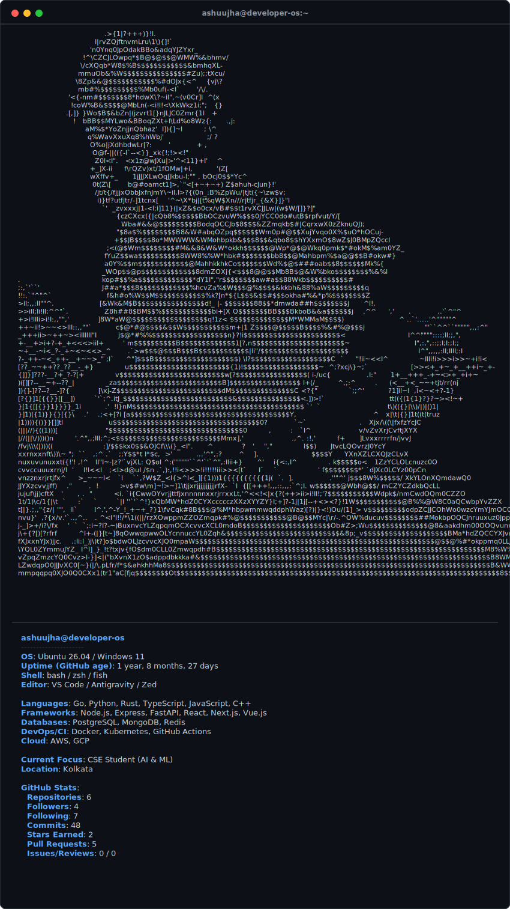

  <h1>👋 I'm Ashutosh Jha</h1>
  <h3>I make 2Ds move | Creative Developer</h3>
  

    
    
    
    
    
  

 

<!-- Terminal Neofetch Card -->

  

 

<!-- About Section -->
## 👤 About

> Currently learning and building projects with a growing interest in Artificial Intelligence and Machine Learning.
> I believe in learning by building and constantly experimenting with new ideas.
> Started working as a freelancer and later expanded into an agency model, now managing regular active clients across India.

---

<!-- GitHub Analytics / Dashboard -->
## Live GitHub Metrics

  
  

 

  
  

 

---

<!-- Recent Activity -->
## Latest Kernel Logs (Recent Activity)

- 🔀 Merged PR [feat: added new seed](https://github.com/tourtravelsmotherindia/motherindiatourtravels/pull/7) in [tourtravelsmotherindia/motherindiatourtravels](https://github.com/tourtravelsmotherindia/motherindiatourtravels) (Jul 13, 2026)
- 🔀 Opened PR [feat: added new seed](https://github.com/tourtravelsmotherindia/motherindiatourtravels/pull/7) in [tourtravelsmotherindia/motherindiatourtravels](https://github.com/tourtravelsmotherindia/motherindiatourtravels) (Jul 13, 2026)
- 🔀 Merged PR [feat: added new seed](https://github.com/tourtravelsmotherindia/motherindiatourtravels/pull/6) in [tourtravelsmotherindia/motherindiatourtravels](https://github.com/tourtravelsmotherindia/motherindiatourtravels) (Jul 13, 2026)
- 🔀 Opened PR [feat: added new seed](https://github.com/tourtravelsmotherindia/motherindiatourtravels/pull/6) in [tourtravelsmotherindia/motherindiatourtravels](https://github.com/tourtravelsmotherindia/motherindiatourtravels) (Jul 13, 2026)

---

<!-- Blog & YouTube Section (Conditional) -->

 

  Last updated: <i>2026-07-19 13:19:58 UTC</i> | System status: <b>Operational</b>

